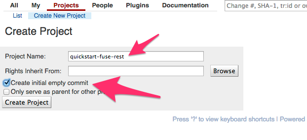
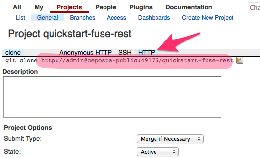

# Setting up Gerrit for the Continuous Delivery Demo
We use docker containers for all of the continuous deliver pieces, so follow the first section on setting up the
Docker container on your host. Docker isn't required if you wish to manually set up an environment somewhere else.

## Set up Docker container
For this container, we're using an image from the scripts in this project. So you'll need to have this project checked
out into a directory from now on referred to $PROJ_ROOT.

To build the Docker image, navigate to the `gerrit-docker` folder:

    cd $PROJ_ROOT/gerrit-docker
    
Then build the image using `gerrit` as the image name:

    docker build -t fabric8:gerrit .
    
Now you should have an image of the gerrit installation we're going to use.

Run the container with this command:

    docker run -itdP --env GITLAB_USER=root --env GITLAB_PASSWORD=redhat01 --env GITLAB_PROJ_ROOT=root --name gerrit --link gitlab:gitlab fabric8:gerrit
    
Note we link to the `gitlab` container, so this container must have been installed first. The username/password are
the credentials we set when creating our gitlab account. [See the GitLab setup instructions for more](set-up-gitlab.md).

Now you can run the following command to see where on the host Gerrit HTTP listener is installed:

    docker port gerrit 8080
    
    
## Set up Gerrit user account

By default, the user account "admin" and "jenkins" are already provided.
You can use the "become" link in the upper right hand to switch to the user you want to become.
The demo will assume the admin account, but you can create additional accounts as desired.

Admin account is:

* __username__ admin
* __password__ GPLvrRrCfpR2

Jenkins account doesn't have an HTTP password (though you can create one if needed)

The `admin` account is associated with the `gerrit-admin` private key (in the [ssh-keys](../gerrit-docker/ssh-keys) folder 
of the _gerrit-docker_ folder, and the `jenkins` account is associated with the `jenkins` private key 
(in the [ssh-keys](../gerrit-jenkins/ssh-keys) of the _jenkins-docker_ folder. The `jenkins` private key is automatically
setup for the [Gerrit Jenkins Plugin](https://wiki.jenkins-ci.org/display/JENKINS/Gerrit+Trigger) in the Jenkins
docker image

## Prep the quickstart-fuse-rest project
Next we need to get the project set up. So just like we created a new project (empty one) on gitlab, we'll do the same
here for Gerrit. Click on "Projects" and then "Create New Project" The name of the project must match the name we
gave to the project in GitLab (because that's how the replication from Gerrit to GitLab happens) and we MUST use the name
__quickstart-fuse-rest__ because that's what's used in the Jenkins builds.

---

---

Now we need to import some code!! We'll check out the quickstart-fuse-rest code from GitHub:

    $ git clone https://github.com/christian-posta/quickstart-fuse-rest.git
    $ cd quickstart-fuse6.1-rest
    
Then we'll need to add the gerrit url as a remote:

    $ git remote add gerrit http://admin@ceposta-public:49166/quickstart-fuse-rest.git
    

Note you'll need to get the HTTP url from here:

---

---

Now we need to configure the git-config with the same values we have in our Gerrit installation:

    git config user.name "Administrator"
    git config user.email "admin@company.com"
    
Then we have to get the commit-msg hook that'll use for generating Change-Ids (which is what gerrit uses for tracking
changes:

    curl -Lo .git/hooks/commit-msg http://ceposta-public:49157/tools/hooks/commit-msg
    chmod +x .git/hooks/commit-msg
        
Note, the URL above to grab the commit-msg is the location of your gerrit installation and "/tools/hooks/commit-msg"

    NOTE: You may also want to take a look at git-review which is a git plugin that helps interact with gerrit [git-review](http://www.mediawiki.org/wiki/Gerrit/git-review) This can take care of setting up the commit hooks and set up the right branches for review

Now we should be ready to push to master (we'll pull first to rebase what's already in gerrit)

    git pull gerrit master
    git push gerrit master
    
__NOTE__ as we'll see in the demo, the correct branch to push to for reviews is:

    git push gerrit HEAD:refs/for/master
    
    
This will cause the code review to kick in.

## Verify replication happened correctly
At this point we have our quickstart-fuse-rest application installed into Gerrit, and since gerrit does repplication
to GitLab, we should see the same code in Gitlab as well. If this happened, everything is working correctly so far.

For me, the path to my Gitlab project is here:
    
    http://ceposta-public:49164/root/quickstart-fuse-rest/tree/master
    
Yours will be wherever you set up gitlab using the Gitlab docker container [as described in setting up Gitlab](set-up-gitlab.md)

## Set up Jenkins user
We will want to create a non-interactive user named "jenkins" that will be able to query gerrit and send events to 
a jenkins build server.

## Random Gerrit Notes: Roles, Reviews, Topics

### Gerrit Topcis:
With gerrit changes are slightly different than with PR because you typically have a single commit to review. However, you can organize multiple commits into “topics” by pushing to 
    
    HEAD:refs/for/master%topic=topic-name

### Gerrit Reviewers
To add a reviewer, add their email to the `r` param:

    HEAD:refs/for/master%topic=first-topic,r=christian.posta@gmail.com

### Gerrit Roles

Life of a patch: http://source.android.com/source/life-of-a-patch.html

* Contributor - an internal or external member of the team who uploads a commit for review
* Reviewer - Any internal or external member of the team who is allowed to post comments on a change and provide score
* Committer - A senior team member allowed to grant a veto or approve, submit, and merge a change
* Build - Batch user (jenkins?) allowed to fetch and provide automated review

### Reviews

* Review/-2 a committer has fundamental reasons for opposing the merge veto cannot be cancelled by another reviewer, and will block the change
* Review/-1 not a blocker for merge, but is a negative score; indication more work is needed to bring into acceptable state
* Review/0  comments
* Review/+1 positive score, no problems found, though reserved for non-committers (reviewers)
* Review/+2 committers think the code should be merged

### Amending code under review

Can click the git link to download the actual change set and start from there:

    git fetch http://ceposta-public:49157/quickstart-fuse-rest refs/changes/01/1/1 && git checkout FETCH_HEAD

Can do this in the same project as master because it checks out the change for you in place. Then make changes, and do a commit —amend:

    git commit --amend

This will cause the commit to use the same change-id (as that’s how commits are tracked)

## What's Next?
You can [go right to the Demo](demo.md) or you can [set up Nexus](set-up-nexus.md) since that's the next container
that should be set up to do the demo.