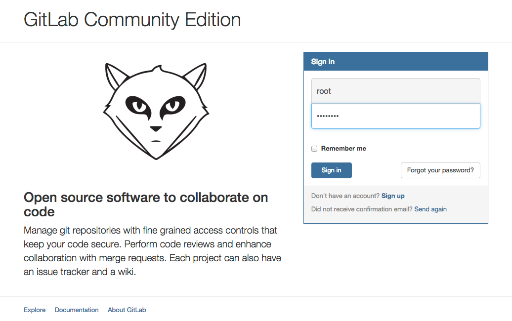
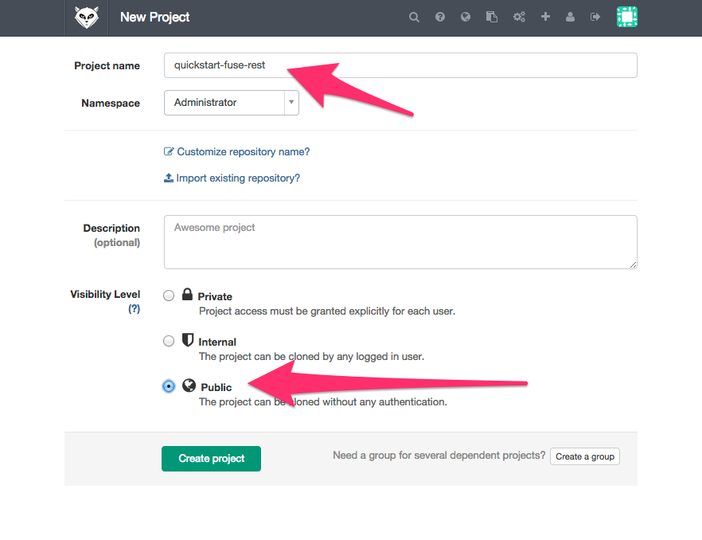

# Setting up Gitlab for the Continuous Delivery Demo
We use docker containers for all of the continuous deliver pieces, so follow the first section on setting up the
Docker container on your host. Docker isn't required if you wish to manually set up an environment somewhere else.

## Set up Docker container
You'll need to pull the GitLab docker image that we use for this demo:
 
    docker pull sameersbn/gitlab:latest
    
Then you can start the container:

    docker run -itdP --name gitlab2 -e 'GITLAB_SIGNUP=true' sameersbn/gitlab:latest
    
To find out what port (on the host) the Gitlab container is listening on (for port 80), run this:

    docker port gitlab 80
    
## Set up user account
    
Then you'll need to navigate to the location on the host where gitlab is exposed, and login with these
credentials (note it could take a minute or two for the GitLab application to initialize and come up):

---

---

Use these default credentials:
    
    username: root
    password: 5iveL!fe

At this point you'll be asked to choose a new password. For the demo, we're using __redhat01__ as the password.

## Adding SSH keys
You should add ssh keys, but you don't have to. If you wish to, you can use the keys located in the $PROJ_ROOT/git folder
of this project. If you don't use SSH keys, you can use HTTP access with the root/redhat01 account as the un/pw

Example of HTTP git url:
    
    http://root:redhat01@__GITLAB_IP__:80/root/quickstart-fuse-rest.git

If you do use the SSH keys, it'll be handy to have this in your ssh config file so you can push to any easy host/port
combo:

    
    Host gitlab 
        Hostname ceposta-public
        Port 49153
        IdentityFile ~/.ssh/redhat_rsa 

That way your git URL can just be:

    git@gitlab:root/quickstart-fuse-rest.git
    

## Setting up the quickstart-fuse-rest project

You should create a new GitLab project and name it exactly __quickstart-fuse-rest__. The naming is important because
the Jenkins build jobs are set up to look for that name.

---

---

__Make sure__ you mark the project public, and make it an empty project. 

We will use Gerrit to replicate code to this Gitlab Project so we don't need to import anything. 